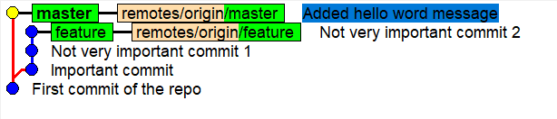

# Welcome To Exersice 3

## The Scenario
You are working on some feature on a branch called `feature`.
While you're working on your feature, the master branch advances.

You've successfully finished your feature.
This is how your git tree looks like:

After you've finished you rebased it onto master in order to get the master updates while you were working on your feature.

The rebase had conflics and you thought that you solved them correctly so you **pushed** the changes.

Ops. You pushed the changes by force i.e. `push --force` becasue you are accustomed to `amend` which requires push force afterwards.
You noticed that you messed up in the rebase and somehow lost a very important commit.

How do you restore the lost commit?

## Set-up
In order to create the environment, you need to open `git bash` shell from this directory and
run the following command:

`./env-setup.sh "<The path to a directory in which you want to have the exercise repository>"`

An exapmle of a real run:

`./env-setup.sh "C:\Users\Public\yoav\GitRepositories\GitLecture\Exercises\Exercise3"`